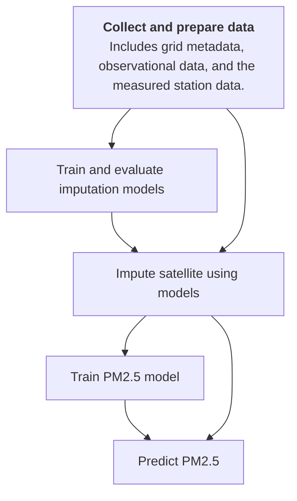
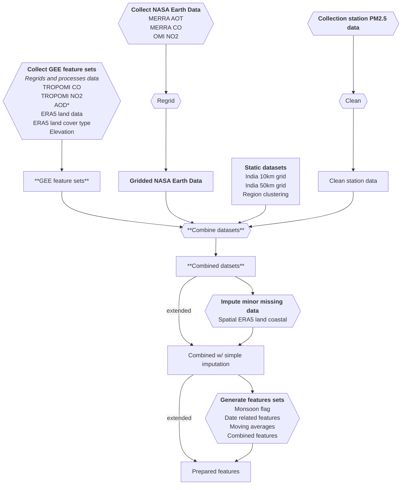
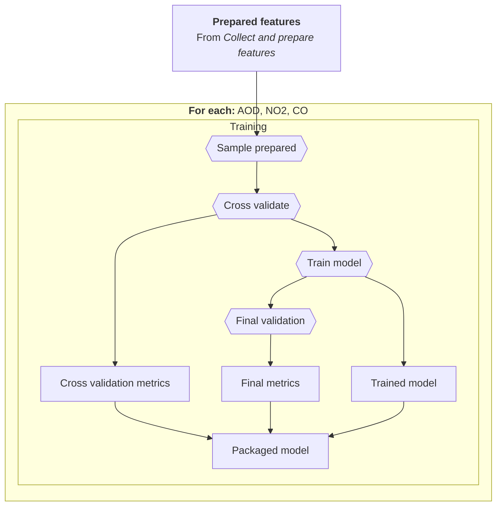
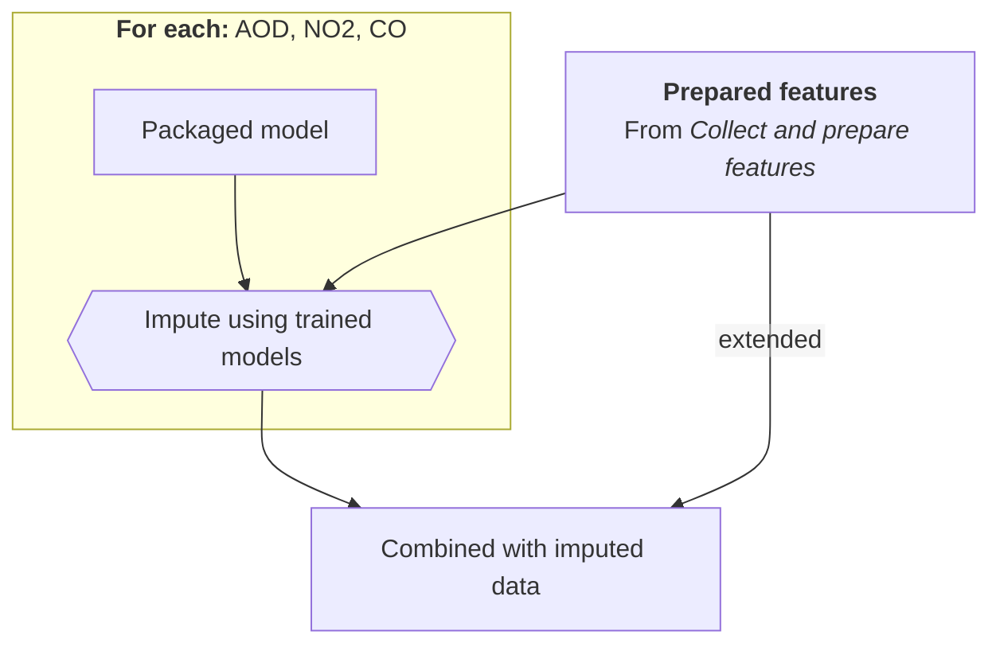
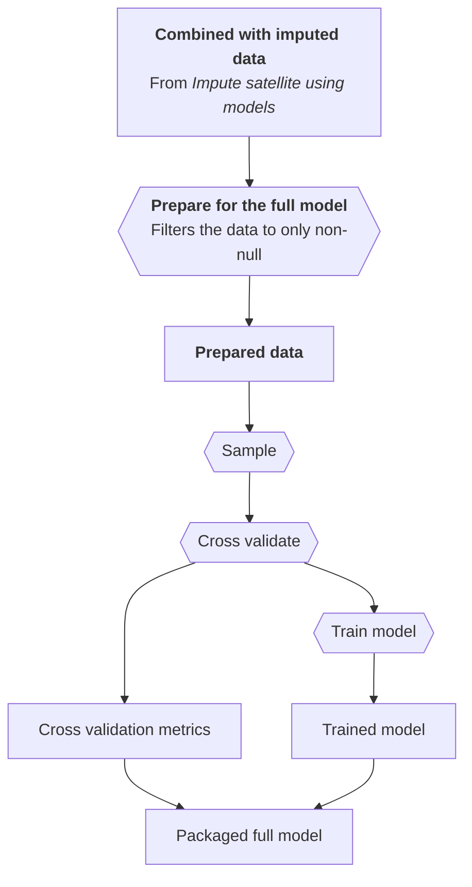

# `pm25ml`: PM2.5 Estimation for India

The aim of this project is to regularly produce raster PM2.5 estimates at a 10 km resolution in
India. It features a two-stage machine learning model for daily PM2.5 predictions.

Based on *[Improved daily PM2.5 estimates in India reveal inequalities in recent enhancement of air quality]*
(developed and published by researchers at Stanford University and collaborators).
This paper created results from 2005-2023 which can be [downloaded from Zenodo].

Reference code (under `reference`) is forked from [`ayako-kawano/pm_prediction`](https://github.com/ayako-kawano/pm_prediction).

## Project layout

The `src/pm25ml` is where most of the code for this project can be found.

We have additional directories:
 - `experiments`: Experiments to inform implementation and to understand reference code.
 - `reference`: The files from the original forked project.

## Contributing

### Getting started

We use poetry to manage the project. To install the dependencies needed run:
```
poetry install --only main,dev
```

To start understanding the code, we suggest that you also read the "Environment", "Architecture" and
"Implementation" sections of this document.

### Dependencies

We use different poetry groups to manage the dependencies: `main` (default), `dev`, `experiment`,
and `reference`. `experiment` and `reference` are used for the `experiments` and `reference` directories.
When adding dependencies, make sure you add them to the correct group.

> [!IMPORTANT]
> Do not add any dependencies that use GDAL to the project. We avoid GDAL to simplify the environment
> for running the code.

### Testing

Add unit tests for new classes and functions. When committing, make sure the tests pass.

We use pytest for the tests. The test files live alongside with original file with the suffixes:
`__test.py` for unit tests or `__it.py` for integration tests.

> [!IMPORTANT]
> When adding new integration tests, these must be marked with `pytest.mark.integration`.

You can run the unit tests from the command line with:
```
poetry run pytest -m "not integration"
```

And you can run the integration tests from the command line with:
```
poetry run pytest -m "integration"
```

The integration tests expect you to be already set up as per the [*Environment* section]:
 - A bucket for test assets (with an environment variable `IT_GEE_ASSET_BUCKET_NAME` for the name set)
 - An environment variable set for `IT_GEE_ASSET_ROOT`, which is where you want the test assets to go
   in GEE.
   
### Running end-to-end

You can run the software end-to-end "locally" using the `src/pm25ml/run/_run_local.py` file.
This script references the other scripts needed to run the whole project end-to-end.

> [!IMPORTANT]
> While this will run the majority of the software locally, the project still requires
> external services to be available, as per the [*Environment* section].
> 
> We suggest using different buckets for  test runs than production to ensure that you
> do not add test data to the production environment.

You can run this with:
```
poetry run python -m "pm25ml.run._run_local"
```

We suggest running with the following (incomplete) `.env` file:
```
# Name of the GCP project
GCP_PROJECT=
# Reference to the shapefile asset in GEE for `assets/grid_india_10km_shapefiles.zip` (which you will need to upload)
INDIA_SHAPEFILE_ASSET=

# Bucket for GEE to upload completed CSVs for further processing
CSV_BUCKET_NAME=
# Bucket to store ingested data in a parquet format (for archiving)
INGEST_ARCHIVE_BUCKET_NAME=
# Bucket for storing any processed data
COMBINED_BUCKET_NAME=
# Bucket to store processed models 
MODEL_STORAGE_BUCKET_NAME=

# Use a limited period of time to run the analysis for - this makes training locally feasible.
START_MONTH=2024-01-01
END_MONTH=2024-06-30

# This takes a fraction of the data we have to make training locally feasible.
TAKE_MINI_TRAINING_SAMPLE=true

SPATIAL_COMPUTATION_VALUE_COLUMN_REGEX=^era5_land__.*$
```

See the [*Environment* section](#Environment) for more details on the environment's dependencies.

### Code standards

We use the "ALL" rules configuration provided by ruff, with an extended line-length of 100
characters.

To make sure your code meets our code standards, install the [`pre-commit`](https://pre-commit.com/)
configuration provided so that your code is checked before committing:
1. Install `pre-commit`, if you haven't already
2. [Install the git hook scripts](https://pre-commit.com/#3-install-the-git-hook-scripts)

## Environment

This project is built around using Google Cloud and its available services. To run it, you will
need:
- a Google Cloud Project
- Google Earth Engine enabled within the project
- Google Cloud Storage Buckets (ideally separate) for the following:
  - Temporary storage of results from Google Earth Engine (with a lifecycle policy to delete results
  after 7 days)
  - Archiving ingested data to store (with versioning optionally enabled to enable reproduction)
  - Processed intermediate and final steps
  - Trained models

In addition, this project also depends on NASA Earthdata. You will need an account with access to
the following and authenticated to run the code:
- Harmony subsetting
- GES DISC datasets

## Architecture

We run this project on Google Cloud and use Google Workflows to provision the compute
for the project. This allows us to run different components with different types of
compute. We aim to only provision compute on-demand to avoid high compute costs.

### Entrypoint

For the entrypoint for the workflows, see `infra/workflow.yaml`. This workflow triggers
individual stages (`src/pm25ml/run/s*`), which rely on dependency injection to get
their dependencies.

### Dependency injection

The runnables for each stage have their dependencies injected from the setup
module `src/pm25ml/setup` and its submodule `dependency_injection`.

Modules and components outside the `setup` directory should avoid coupling their
implementation to the precise data, workflow, and features required for the pipeline
(especially where these values might change). Instead, the `setup` and its submodules
should define these as "configuration" instead.

### Collecting

Daily data is collected at monthly intervals and must be stored using parquet with hive
partitioning a key for each year month. This allows for iterative loading of new
datasets and partial loading at different levels.

### Processing

Components should to only load a single month's data at a time to avoid a dependency
of expensive compute for each layer.

Components should be idempotent and should avoid doing work if it's not needed.
For example, when combining data from multiple sources, if the original sources
haven't changed, the component shouldn't recompute the data.

However, if this isn't possible, larger compute can be provisioned.

## Implementation

This shows the overall process and data flow for this project. More detail is provided on these
areas in the document below.



### Collect and prepare features

We collect and combine data for each month in the analysis period.

Simple imputation that happens at this stage can include spatial or temporal imputation using
nearest neighbour or interpolation.



### Train and evaluate imputation models

This shows the broad overall implementation of training each imputation model.

We use a fixed set of hyperparameters based on the paper.




### Impute satellite using models

This shows the processing that happens at the satellite imputation stage.



### Train PM2.5 model

This shows the workflow followed to train the model.



## Citations

### Models

Kawano, Ayako, Makoto Kelp, Minghao Qiu, Kirat Singh, Eeshan Chaturvedi, Sunil Dahiya,
Inés Azevedo, and Marshall Burke. "Improved daily PM2. 5 estimates in India reveal inequalities in
recent enhancement of air quality." Science Advances 11, no. 4 (2025): eadq1071.

### Bundled test datasets

#### `M2T1NXAER.5.12.4_MERRA2_400.tavg1_2d_aer_Nx.20230101_TOTEXTTAU_subsetted.nc4`

NASA Global Modeling and Assimilation Office (GMAO). (2015).
*MERRA-2 tavg1_2d_aer_Nx: Aerosol Diagnostics, Hourly 0.5° × 0.625°, V5.12.4 (M2T1NXAER)* [Data set].
Goddard Earth Sciences Data and Information Services Center (GES DISC), NASA GSFC.
https://doi.org/10.5067/KLICLTZ8EM9D  
(Accessed 24 Jun 2025; licence — CC-0 1.0. NASA does not endorse this software.)

#### `OMI-Aura_L3-OMNO2d_2023m0111_v003-2023m0223t191034.he5`

NASA Goddard Space Flight Center. (2023).
*OMI/Aura NO₂ Cloud-Screened Total and Tropospheric Column L3 Global Gridded 0.25° × 0.25° V003* (OMNO2d) [Data set].
NASA Goddard Earth Sciences Data and Information Services Center (GES DISC).
https://doi.org/10.5067/Aura/OMI/DATA3002  
(Accessed 24 Jun 2025; licence — CC-0 1.0. NASA does not endorse this software.)

[Improved daily PM2.5 estimates in India reveal inequalities in recent enhancement of air quality]: https://www.science.org/doi/10.1126/sciadv.adq1071
[downloaded from Zenodo]: https://zenodo.org/records/13694585
[*Environment* section]: #environment
